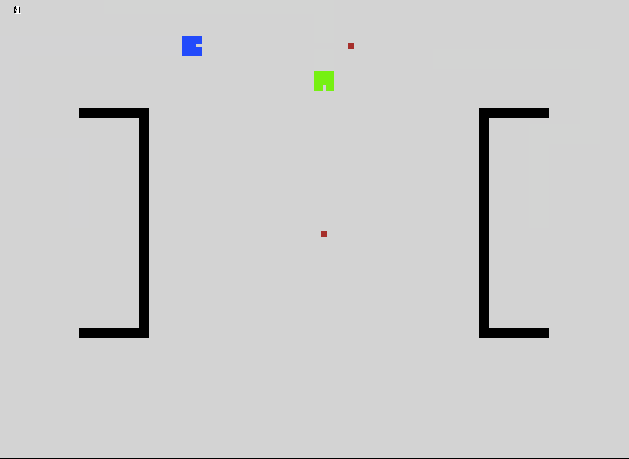

# tankbeta

Around 15 years ago (in the year 2000), I wrote my first video game.
I dug up the code recently and couldn't believe how ridiculous it
is. A really crappy game implemented with some truly atrocious code.

I decided that the only reasonable thing to do with this code is
port the game to run on modern platforms. To make it fun, I'd do
the port without changing a single line of the original source code.

In addition to the port, I also whipped up an [online playable
version](http://tankbeta.sortelli.com/play) of the game, and and
amusing set of [annotated source](http://tankbeta.sortelli.com/source).

## The Game

This game is similar to the tank game in [Atari
Combat](http://en.wikipedia.org/wiki/Combat_%281977_video_game%29). Both
players play using the same keyboard, and can shoot one bullet at
a time.




### Keyboard Controls

    Command    |  Player 1  | Player 2
    -----------|------------|------------
    Forward    |  E         | UP_ARROW
    Backward   |  C         | DOWN_ARROW
    Turn Left  |  S         | LEFT_ARROW
    Turn Right |  F         | RIGHT_ARROW
    Fire       |  D         | ENTER

### Play Online!

I've also created a quick-and-dirty web based implementation. Play
it using the same controls listed above at
[http://tankbeta.sortelli.com/play](http://tankbeta.sortelli.com/play).

## The Port

The original game was written in Borland C++, using the [Borland
Graphics Interface](http://www.cs.colorado.edu/~main/bgi/doc/) (BGI)
as the graphics layer. I've created a shim between the BGI functions
called in the game code, and [libsdl](https://www.libsdl.org/).

The shim code also helps clean up a few minor issues to allow the
older Borland C++ code to build using a modern version of gcc.

## Project Layout

The project has the following layout:

    tankbeta
    ├── Makefile
    ├── README.md
    ├── docs                 # Annotated source code
    ├── fonts                # Contains open source courier font
    ├── original_source      # Contains unmodified original game source code
    ├── shims                # Shim between BGI and SDL graphics libraries
    ├── tankbetajs           # HTML5 re-implementation of the game, to play in the web
    └── third_party_source   # Contains original third-party code used by the game

## Building

### Dependencies

The included ```Makefile``` will build the game. Along with the
typical build tools (make, gcc, pkg-config, etc) you will need
libsdl v1.2.15 and SDL_ttf v2.0.11.  Using Homebrew on Mac, these
dependencies can be installed with:

    % brew install sdl sdl_ttf

### Make

Build by simply running ```make```:

    % make

## Running

Run ```tankbeta``` to play:

    % ./tankbeta
